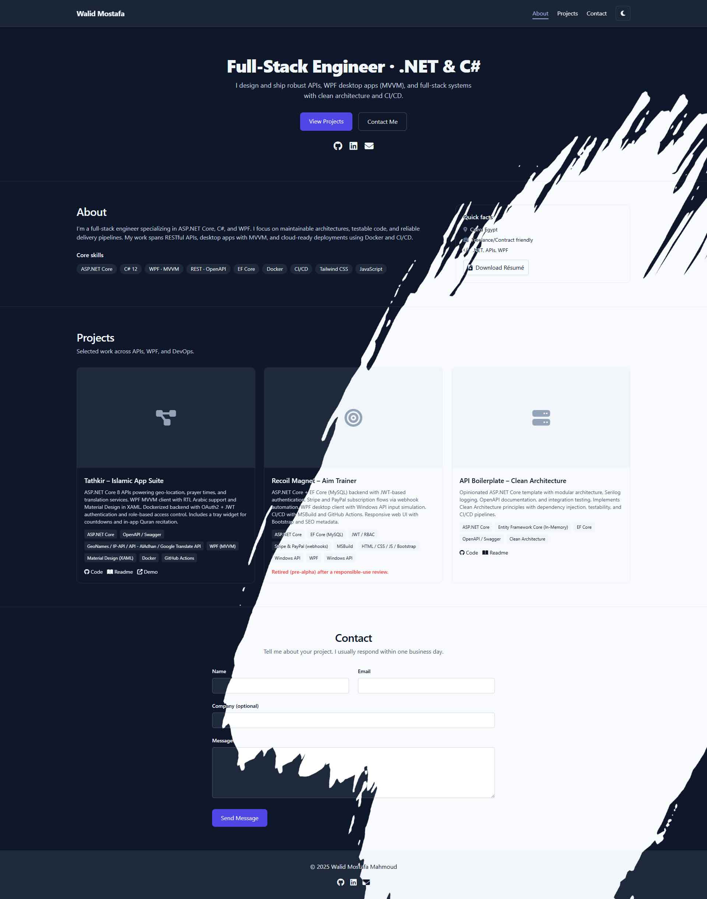

# Portfolio

A fast, accessible personal portfolio site. It’s a static site you can host anywhere, built with semantic HTML, modern CSS, and vanilla JavaScript—no frameworks or build step required.

## Preview



## Features

- Light/Dark theme toggle with persistence (localStorage) and preloaded theme to avoid flash of incorrect theme
- Mobile menu with accessible controls (aria-expanded) and Escape to close
- Scrollspy that highlights the current section in the navbar, header-aware and robust at page bottom
- Contact form demo with HTML5 validation and honeypot field (ready to swap for a serverless endpoint)
- Subtle 3D tilt + parallax effect on project cards, respecting “reduced motion” preferences
- Progressive enhancement, no external JS dependencies

## Project structure

```
docs/
	index.html
	assets/
		icons/
		images/
	css/
		styles.css
	js/
		app.js
		theme-preload.js
```

- `theme-preload.js`: Sets the theme class on `<html>` early to prevent a flash of the wrong theme.
- `app.js`: All interactive behaviors (theme toggle, mobile menu, scrollspy, contact form demo, tilt/parallax).
- `styles.css`: Styles for layout, typography, and components.

## Getting started

You can open the site directly or serve it locally.

### Option A: Open directly

1. Open `src/index.html` in a browser.

### Option B: Serve locally (recommended)

Serving avoids CORS issues and mirrors production hosting better.

- Using VS Code Live Server extension: Right‑click `src/index.html` → “Open with Live Server”.
- Using a simple static server (Node installed):

```powershell
npx serve "src"
```

Then open the printed URL (e.g., http://localhost:3000).

## Usage and customization

### Theme toggle

- Any button with `[data-theme-toggle]` toggles the theme.
- The current theme is stored in `localStorage` under `theme` as `light` or `dark`.
- `theme-preload.js` applies the saved theme before the main CSS loads, preventing a FOUC.

Example button:

```html
<button type="button" data-theme-toggle aria-label="Toggle theme">Toggle</button>
```

### Mobile navigation

- The menu button (e.g., `#menuToggle`) controls the mobile menu (`#mobileMenu`).
- `aria-expanded` reflects the open state, and pressing Escape closes it.
- The menu auto-closes when switching to a desktop viewport (`min-width: 768px`).

### Scrollspy

- Highlights the nav link that corresponds to the section in view.
- Works alongside a fixed header and handles the bottom-of-page edge case.

### Contact form (demo)

- Uses native HTML5 validation and shows a success message after a simulated delay.
- Contains an optional honeypot field (e.g., `name="website"`) to reduce spam—submissions with a value are ignored.
- Replace the simulated submit with a real endpoint (e.g., a serverless function) when you’re ready.

### Tilt + parallax on project cards

- Cards with the class `.project-card` will tilt on pointer hover.
- You can optionally move a child element for a parallax effect. Mark it with `data-tilt-media` or ensure it matches one of the defaults: `.project-media`, `.card-media`, `.cover`, `img`, or `video`.

Example markup:

```html
<article class="project-card">
	
	<!-- ...other content... -->
  
</article>
```

Behavior details (in `js/app.js`):

- Respects user motion preferences: disabled if `prefers-reduced-motion: reduce`.
- Uses pointer events for broad device support.
- Customize intensity via these constants near the top of the module:

```js
const ROT_MAX = 6;   // degrees of card rotation
const SHIFT_MAX = 6; // px of media parallax movement
```

To disable the effect entirely, remove or comment out the “Fancy tilt + parallax” IIFE in `app.js`.

## Accessibility

- Motion sensitivity: tilt/parallax is disabled when the OS setting is “Reduce motion”.
- Keyboard support: Escape closes the mobile menu.
- Semantic anchors: Scrollspy uses section IDs and nav anchors; `aria-current="page"` is set on the active link.

## Browser support

Modern evergreen browsers. The site progressively enhances features and should degrade gracefully on older browsers (effects may be disabled).

## Deployment

This is a static site—host it on any static hosting provider.

Popular options:

- GitHub Pages

Minimum setup for GitHub Pages:

1. Commit and push the repository.
2. In repo settings → Pages, select the branch and set the folder to `/docs`.
3. Save to publish.

## Roadmap / TODO

- Hook the contact form to a real serverless endpoint (e.g., Netlify Functions, Cloudflare Workers, AWS Lambda)
- Add tests or linting if this grows (e.g., Prettier/ESLint for consistency)
- Optional: add a blur or depth-of-field effect on media when tilting
